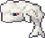

<div align="center">

<h1 align="center"> enclose.moby </h1>

### *Enclose the Moby Dick in the biggest possible pen!*

[](https://kutluyigitturk.github.io/enclose.moby)
[](https://github.com/kutluyigitturk/enclose.moby)
[](https://developer.mozilla.org/en-US/docs/Web/HTML)
[](https://developer.mozilla.org/en-US/docs/Web/JavaScript)
[](https://developer.mozilla.org/en-US/docs/Web/CSS)

<div align="center">

  
  <br>
  <em>Desktop — Google Chrome - Playground</em>
  <br><br>

  
  <br>
  <em>Desktop — Google Chrome - Winning Animation</em>
  <br><br><br>

  <p align="center">
    
    &nbsp;&nbsp;&nbsp;&nbsp;
    
    <br><br>
    <em>&nbsp;&nbsp;&nbsp;&nbsp;&nbsp;&nbsp;&nbsp;&nbsp;&nbsp;&nbsp;iPhone 13 — Safari - Playground&nbsp;&nbsp;&nbsp;&nbsp;&nbsp;&nbsp;&nbsp;&nbsp;&nbsp;&nbsp;&nbsp;&nbsp;&nbsp;&nbsp;&nbsp;&nbsp;&nbsp;&nbsp;&nbsp;&nbsp;&nbsp;&nbsp;&nbsp;&nbsp;&nbsp;&nbsp;&nbsp;&nbsp;&nbsp;&nbsp;&nbsp;&nbsp;iPhone 13 — Safari - Winning Animation</em>
  </p>

<br> </div>

*A strategic puzzle game where you trap the legendary white whale*
</div>

---

## 📖 The Story Behind the Game

enclose.moby started as a single idea: what if you could trap Moby Dick using buoys? The first version had one level, basic click interactions, and almost no visual polish. But the core puzzle loop felt satisfying — and that was enough to keep building.

**The game needed to feel alive.** In the early versions, Moby Dick just sat there waiting. He had no personality, no reaction. So he got a voice. Hovering over him now reveals his escape route with a directional arrow — you can see exactly where he plans to go. He reacts to your moves through pixel-art speech bubbles, taunts you when he sees an opening, and goes quiet when he's cornered. He even sounds different every time. The goal was to make you feel like you're actually hunting something, not just clicking tiles.

**The game needed to be fair.** Puzzle games live and die by clarity. Players needed to understand why they won, and whether they could have done better. This is why the optimal solution preview exists — after winning, you can compare your enclosure against the mathematically best possible solution. If you already found the optimal answer, the game tells you. No ambiguity, no frustration. You either solved it perfectly or you have something to aim for.

**The game needed honest feedback.** When you run out of buoys, the counter shakes and flashes red. It sounds minor, but without it players assumed the game had a bug. Small signals matter enormously. The same thinking produced the ghost preview — a translucent buoy appears before you commit to placing it, removing uncertainty and making every move feel intentional rather than accidental.

**The game needed a sense of triumph.** Winning a puzzle should feel like an event, not just a state change. When Moby is finally enclosed, the world outside his pen dims into darkness, a field of stars blooms across the trapped waters, and a lighthouse rises from the sea — its lantern slowly coming to life. None of this was in the original version. The first implementation simply stopped the game and displayed a score. It felt hollow. The winning animation exists because the moment of capture deserves ceremony. You spent minutes studying the map, planning your buoys, watching Moby's escape arrows — the payoff should match the effort.

**The game needed to sound alive.** For a long time, enclose.moby was completely silent. Moby got his voice first — hover over him and you hear a whale call, different each time. But silence between those moments felt wrong. Now every buoy placement lands with a splash, every removal pops cleanly, and resetting a level has its own sound. When the lighthouse rises on a winning screen, a distinct chime marks the moment. These are small, deliberate sounds — not a soundtrack, but punctuation. They confirm that your actions are registering, that the world is responding. A game without sound is a game without feedback, and feedback is everything.

**The game needed to get out of the player's way.** Early versions had a single level, and navigating between puzzles meant opening a menu every time. It broke the flow. Now Prev and Next buttons sit right on the canvas — you finish a puzzle, tap Next, and you're already in the next one. The same thinking applied to the reset button: in a submitted level, accidentally hitting Reset used to wipe your solution without warning. A simple confirmation dialog fixed that. These aren't exciting changes. Nobody will screenshot a confirmation modal. But every time a player doesn't lose their progress by accident, the game earns a little more trust. Dark grid lines, light grid lines, hiding Moby's speech bubbles — each toggle exists because someone, somewhere, would have a better experience with it turned on or off. Ten levels now live in the game, some designed by hand, some generated by a custom deep learning model. And a feedback button sits quietly in the menu, because the fastest way to find what's broken is to ask the people who are actually playing.

**The game needed to speak your language.** Turkish and English are both fully supported, down to a custom-built font that includes the Turkish characters missing from the original typeface. The grid opacity, the sound, the language — all configurable, because different players want different things from the same game.

**The game needed a solid foundation.** At one point the entire codebase was a single 2000-line HTML file. It worked, but it was fragile. A full restructure split everything into nine dedicated JavaScript modules. Players never saw this change, but it made every subsequent improvement faster, safer, and cleaner. Good architecture is invisible until the moment you need it.

The game is still being built. Every version exists because something felt incomplete, something felt unfair, or something felt like it could be more beautiful. That's the only roadmap that matters.

---

## 🎮 How to Play

**Objective:** Trap Moby Dick in the biggest possible area using buoys.

| Action | Desktop | Mobile |
|--------|---------|--------|
| Place buoy | `Left Click` on sea tile | `Tap` on sea tile |
| Remove buoy | `Left Click` on placed buoy | `Tap` on placed buoy |
| Navigate levels | `‹ Prev` / `Next ›` buttons | Same |
| Reset level | Click `Reset` button | Tap `Reset` button |

### 📋 Rules

- 🌊 Click/tap on sea tiles to place buoys
- 🚫 You have limited buoys per level
- 🐋 Moby Dick cannot swim diagonally or over buoys
- 📏 Bigger enclosure = Higher score
- ✨ The game auto-detects when Moby is trapped

---

## ⚡ Features

### 🧠 Smart Game Mechanics
- **Auto-Detection System** — BFS algorithm instantly calculates if Moby Dick is trapped after each buoy placement
- **Area-Based Scoring** — Score is determined by the size of the enclosed area
- **Optimal Solution Preview** — Compare your solution against the mathematically best enclosure
- **Non-Blocking Gameplay** — No annoying pop-ups; continue playing even after winning

### 🎨 Visual & UI Enhancements
- **Layered Rendering System** — 8 distinct render layers for terrain, grid, entities, effects and UI
- **Winning Ceremony** — Darkness, star field, lighthouse animation on capture
- **Speech Bubbles** — Moby reacts to your moves with pixel-art dialogue (toggleable in Settings)
- **Escape Path Visualization** — Hover over Moby to see his calculated escape route
- **Customizable Grid** — Dark/light grid lines toggle with adjustable opacity via Settings

### 📱 Cross-Platform Support
- **Full Mobile Support** — Touch controls work seamlessly on iOS and Android
- **Responsive Design** — Game scales to fit any screen size
- **Dynamic Tile Sizing** — Grid adapts from 15px to 60px based on device

### 🖥️ User Interface
- **Level Navigation** — Canvas-native Prev/Next buttons aligned to the grid
- **TR/EN Localization** — Full Turkish and English support with custom font
- **Player Feedback** — Google Form integration for suggestions and bug reports
- **Dropdown Menu** — Access past puzzles, settings, feedback and about sections

---

## 🛠️ Technical Details

```
├── index.html        # Entry point
├── style.css         # All UI styles
├── README.md         # This file
└── js/
    ├── config.js     # Constants & game configuration
    ├── strings.js    # Localization strings for TR / EN
    ├── levels.js     # Level data (10 hand-crafted + AI-generated puzzles)
    ├── assets.js     # Base64 sprites & audio
    ├── bubble.js     # 9-slice speech bubble system & rendering
    ├── state.js      # Game state, sound management, asset loading
    ├── ui.js         # Menus, modals, input handling & resize
    ├── game.js       # Core logic: waves, win condition, BFS pathfinding
    ├── renderer.js   # 8-layer rendering pipeline & draw loop
    └── main.js       # Entry point: initGame & event listeners
```

| Technology | Usage |
|------------|-------|
| HTML5 Canvas | Game rendering |
| Vanilla JavaScript | Game logic & BFS pathfinding |
| CSS3 | UI styling & animations |
| [Base64](https://www.base64-image.de/) | Embedded sprites & assets |

---

## 🗺️ Roadmap

- [x] Core gameplay mechanics
- [x] BFS pathfinding algorithm
- [x] Dynamic wave animations
- [x] Area-based scoring system
- [x] Mobile touch support
- [x] Modular JS architecture — 9 dedicated modules
- [x] 10 puzzle levels (hand-crafted + AI-generated)
- [x] Optimal solution preview & comparison
- [x] TR/EN localization with custom font
- [x] Winning ceremony (darkness, stars, lighthouse)
- [x] Level navigation (Prev/Next)
- [x] Player feedback system
- [x] Customizable settings (grid style, Moby thoughts)
- [ ] Level editor
- [ ] Leaderboard system

---

## 🚀 Run Locally

```bash
# Clone the repository
git clone https://github.com/kutluyigitturk/enclose.moby.git

# Open in browser
cd enclose.moby
open index.html  # macOS
# or
start index.html # Windows
```

Or simply visit: **[kutluyigitturk.github.io/enclose.moby](https://kutluyigitturk.github.io/enclose.moby)**

---

<div align="center">

### Can you trap the Moby Dick?

Made with ❤️ by [Kutlu Yigitturk](https://github.com/kutluyigitturk)

<br>

[](https://github.com/kutluyigitturk)
[](https://www.linkedin.com/in/kutlu-yigitturk/)
[](https://twitter.com/KutluYigitturk)

</div>
